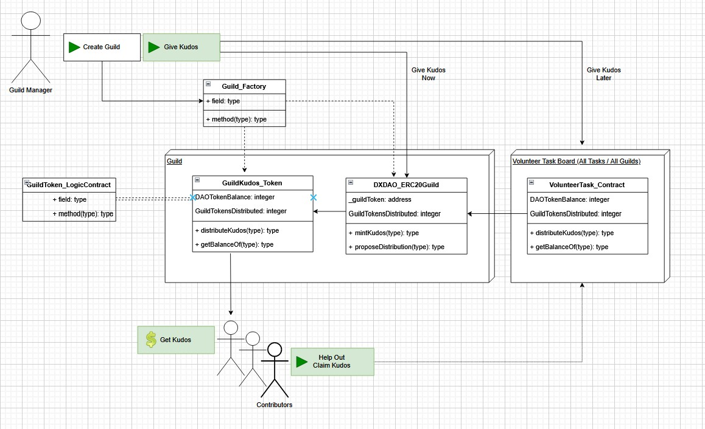

# kudos - upgrade our food system

### Rewards and Incentivization for Farmers and Supporters of our Food System

## Overview 

The scaffold-eth user experience will be simplified in a way that the user will not be aware that they are using web3 technologies and modern approaches.  The UI will be familiar, requiring only an email address for login with a Magic Link.  Tokens will be held in "no-custodial" wallets; private keys will not be known or necessary as the tokens are unable to be transferred.  Users can be airdropped rewards, or will be able to scan a QR code to validate participation.  We may consider adding options for participants to control their wallets but the current priority is ease of use and lowering barriers to entry. 

A bigger picture aspect which will be developed with the input of stakeholders across the state is a new LCA/DAO for the agrigultural community.  This will provide a novel way for everyone directly involved in our ecosystem to contribute to the success of Colorado agriculture.

We will use the guild model to identify any group involved in Colorado agriculture.  Based on the desires of the greater community, guilds will be incentivized to perform certain activities which will grant them the ability to recognize contributors using our "Guild kudos" token.  Because kudos are valuable to contributors, farmers and others will be motivated to align with the DAO.  This is a novel mechanism for aligning regional and local interests by harnessing the power of those who are already contributing.

Digging deeper into the tech, both guilds and dao's will be managed using the DX DAO guild and daostack models.  A future state may allow members to govern locally as well as at the regional or even global level.  This framework also allows for automated verification of proposals requiring kudos distributions.

## Harmony Deployment Info (Testnet)  
Initial Contract: 0xF36121C1a9935B522A35Ffdf99F9C224a7574A56  
Guild Proxy: 0x3d4F2D7562034599168796cd388B82194de2AB13  
Guild Implementation: 0x653F9F652e5320076aF00C6a17411a5E1BF01A82  

## Contact Us

<!-- Please don't remove this: Grab your social icons from https://github.com/carlsednaoui/gitsocial -->

<!-- display the social media buttons in your README -->

#### Bill
[![alt text][1.1]][BILL-twitter]
[![alt text][6.1]][BILL-github]
#### Daniel
[![alt text][1.1]][DANIEL-twitter]
[![alt text][6.1]][DANIEL-github]
#### o080o
anon
#### Pat
[![alt text][1.1]][PAT-twitter]

<!-- links to social media icons -->
<!-- no need to change these -->

<!-- icons with padding -->

[1.1]: http://i.imgur.com/tXSoThF.png (twitter icon with padding)
[2.1]: http://i.imgur.com/P3YfQoD.png (facebook icon with padding)
[3.1]: http://i.imgur.com/yCsTjba.png (google plus icon with padding)
[4.1]: http://i.imgur.com/YckIOms.png (tumblr icon with padding)
[5.1]: http://i.imgur.com/1AGmwO3.png (dribbble icon with padding)
[6.1]: http://i.imgur.com/0o48UoR.png (github icon with padding)

<!-- icons without padding -->

[1.2]: http://i.imgur.com/wWzX9uB.png (twitter icon without padding)
[2.2]: http://i.imgur.com/fep1WsG.png (facebook icon without padding)
[3.2]: http://i.imgur.com/VlgBKQ9.png (google plus icon without padding)
[4.2]: http://i.imgur.com/jDRp47c.png (tumblr icon without padding)
[5.2]: http://i.imgur.com/Vvy3Kru.png (dribbble icon without padding)
[6.2]: http://i.imgur.com/9I6NRUm.png (github icon without padding)

<!-- links to your social media accounts -->
<!-- update these accordingly -->

[DANIEL-twitter]: http://www.twitter.com/deploydan
[DANIEL-github]: http://www.github.com/denvercitizen9
[BILL-twitter]: http://www.twitter.com/webthe3rd
[BILL-github]: http://www.github.com/webthethird
[PAT-twitter]: http://www.twitter.com/patonchain

<!-- Please don't remove this: Grab your social icons from https://github.com/carlsednaoui/gitsocial -->
